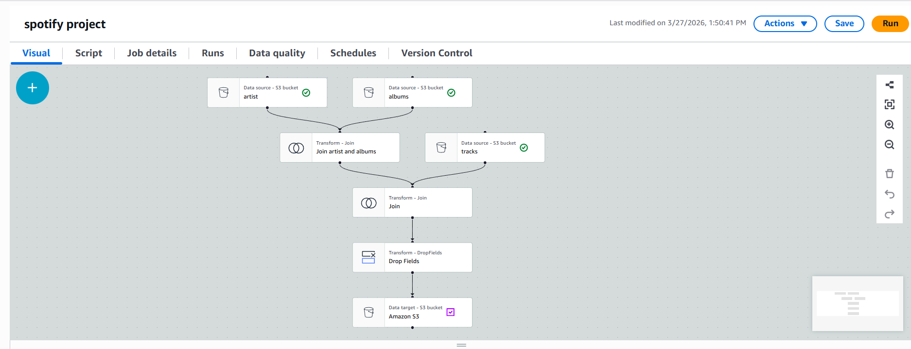
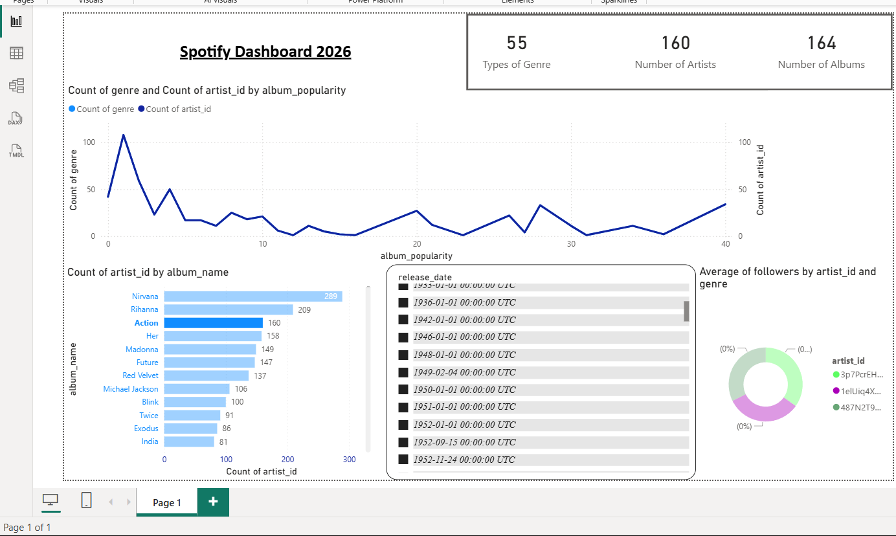

# 🎧 Spotify Data Pipeline & Dashboard Project

## 📌 Project Overview
This project demonstrates an end-to-end data pipeline using AWS services and Power BI to analyze Spotify data.

---

## 🏗️ Architecture
Kaggle Dataset → AWS S3 → AWS Glue Crawler → Glue Data Catalog → AWS Glue ETL Job → S3 (Processed Data) → Power BI Dashboard

---

## ⚙️ Technologies Used
- AWS S3
- AWS Glue (Crawler + ETL)
- Power BI
- CSV / Parquet Data

---

## 🔄 Data Pipeline Steps

1. Collected dataset from Kaggle (Albums, Artists, Tracks)
2. Uploaded raw data into S3 bucket
3. Created Glue Crawler to generate tables in Data Catalog
4. Used Glue Visual ETL:
   - Joined Album, Artist, and Track tables
   - Performed transformations
5. Stored processed data back into S3
6. Downloaded final dataset
7. Built interactive dashboard in Power BI
   
---

## 📊 Dashboard Features
- Top artists and albums
- Track popularity analysis
- Trends and comparisons
- Interactive filtering

---

## 📸 Dashboard Preview

---

## 📂 Dataset Access
Due to GitHub size limits, full dataset is available here:

🔗 [https://your-google-drive-link](https://drive.google.com/drive/folders/19ki8vEbdCLbjvNSmlQDKgjJpTY0Jcxjv?usp=drive_link)

---

## 🌟 Key Learnings
- Built ETL pipeline using AWS Glue
- Understood Data Catalog and Crawlers
- Worked with Parquet format
- Integrated AWS data with Power BI

